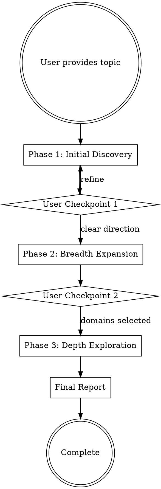

# Deep Research

## Overview

Structured 3-phase research methodology using Tavily CLI for search and **Firecrawl CLI (REQUIRED)** for content scraping. Research progresses from broad discovery → targeted expansion → deep domain exploration, with user collaboration at key decision points.

**Core principles:**
1. **Research quality comes from iterative refinement guided by human judgment**, not automated execution
2. **Raw content MUST be preserved** - every high-value source scraped with Firecrawl
3. **Source attribution is mandatory** - every synthesis references original scraped files
4. **Content quality MUST be validated** - use Quality Validator Agent after every scrape (NOT simple word count)
5. **Tavily results MUST be saved** - preserve search metadata and AI answers in raw-results/

## When to Use

- Complex research topics requiring synthesis from multiple sources
- Topics where you need to discover unknown unknowns
- Research requiring authoritative source identification
- When user has vague research needs that need clarification
- Building comprehensive reports with evidence-based arguments

**Do NOT use for:**
- Simple factual lookups (single Tavily search is sufficient)
- Research with clearly defined, narrow scope
- Time-sensitive queries requiring immediate answers

## Prerequisites

### Tavily CLI

Install from local source (assumes skill repo cloned to `~/.claude/skills/deep-research/`):

```bash
# Check if already installed
which tavily && tavily --help

# Install from local path
uv tool install ~/.claude/skills/deep-research/tavaliy-cli

# Update (if needed)
uv tool uninstall tavily
uv tool install ~/.claude/skills/deep-research/tavaliy-cli
```

**Configure API Keys:**

```bash
cd ~/.claude/skills/deep-research/tavaliy-cli
cp .env.example .env
# Edit .env and add your Tavily API key(s)
```

Supports multiple keys for automatic rotation (TAVILY_API_KEY_1, TAVILY_API_KEY_2, etc.)

### Firecrawl CLI (REQUIRED)

```bash
npm install -g firecrawl
export FIRECRAWL_API_KEY="your-key"
```

## Source Evaluation (NEW - Pre-Scraping)

**BEFORE scraping, use Source Evaluator Agent to filter Tavily results.**

### Why Pre-Evaluation Matters

- Tavily Score ≠ content quality (many 1.00 scores lead to 404 pages)
- Some sites block direct article access but allow homepage + crawl

### Source Evaluation

First, read `references/quality-evaluator.md` (Mode 1: Pre-Scrape Assessment) for detailed evaluation guidelines.

Then invoke:

```markdown
Evaluate sources (Pre-Scrape Mode):
- Research topic: {topic}
- Results file: ./01-initial-discovery/raw-results/search-01.json

Use skill: quality-evaluator

Output: JSON with recommended/excluded URLs and risk assessment
```

### Domain Risk Awareness

**High Risk (frequent 404/invalid URLs):**
- 中文门户网站：sina.com.cn, sohu.com, 163.com, ifeng.com
- 中新网地方频道：chinanews.com.cn 地方子站
- 临时活动页面

**Strategy for high-risk domains:**
1. Try direct scrape first (quick fail check)
2. If 404 → extract homepage URL
3. Use `firecrawl map "https://homepage.com"` to discover valid content
4. Or skip and find alternative sources

## Content Quality Validation (CRITICAL)

**Every scraped file MUST be validated using Quality Validator Agent before entering synthesis.**

### Why Deep Validation is Required

Firecrawl may return:
- 404/403 error pages (even 5-line nginx errors)
- CAPTCHA/login walls
- Marketing pages with high word count but low substance
- Thin content with mostly navigation/ads

**Simple word-counting FAILS:**
- `jadeinno-ezither.md`: 399 lines but pure marketing fluff
- `chinanews-hebeibei.md`: 404 page can have 17 lines of redirect HTML
- `huain-dian-guzheng.md`: 5-line nginx 404 (should not pass quality gate)

### Quality Validator Usage

First, read `references/quality-evaluator.md` (Mode 2: Post-Scrape Validation) for detailed validation guidelines.

Then invoke:

```markdown
Validate content (Post-Scrape Mode):
- Research topic: {topic}
- File to validate: ./raw-content/example-source.md
- Source URL: {original_url}

Use skill: quality-evaluator

Output: JSON assessment with quality rating
```

### Quality Ratings

| Rating | Criteria | Action |
|--------|----------|--------|
| **high** | Weighted score >= 7.5, passed validity | Keep and prioritize |
| **medium** | Weighted score 5.0-7.4, passed validity | Keep for synthesis |
| **low** | Weighted score < 5.0, passed validity | Discard |
| **failed** | Failed validity (404/error/CAPTCHA) | Discard + retry |

### Quality Gate Thresholds (Optimized)

Based on autoresearch optimization (targeting 50 total sources with authority-weighted scoring):

**Phase 1 (Initial Discovery):**
- **Queries**: 7 broad queries
- **Max results**: 15 per query
- **Min quality score**: 0.52
- Minimum: 5 high/medium quality sources
- Target: 8 sources
- Ideal: 10+ diverse sources

**Phase 2 (Breadth Expansion):**
- **Queries**: 9 targeted queries
- **Max results**: 12 per query
- **Min quality score**: 0.62
- Minimum: 8 high/medium quality sources
- Target: 12 sources
- Ideal: 15+ sources

**Phase 3 (Depth Exploration):**
- **Queries**: 8 deep queries
- **Max results**: 10 per query
- **Min quality score**: 0.67
- Minimum: 10 high/medium quality sources
- Target: 15+ sources
- Ideal: 20+ authoritative sources

**Overall Strategy:**
- **max_total_sources**: 50 (across all phases)
- **Scoring priority**: Authority (0.45) > Density (0.25) > Coverage (0.15) = Freshness (0.15)

**Rule: Do NOT proceed to synthesis until quality gate is met.**

### Retry Mechanism

When quality validation fails or quality gate is not met:

1. **Record failures** - document which URLs failed and why
2. **Analyze patterns** - are URLs consistently 404? Behind paywalls?
3. **For high-risk domains** - try homepage crawl/map strategy
4. **Design new searches** - adjust queries, try different angles
5. **Execute new Tavily searches** - find replacement sources
6. **Scrape and validate** - repeat validation on new content
7. **Loop until quality gate is satisfied**

## Firecrawl Integration (REQUIRED)

**Every research phase MUST use Firecrawl to scrape high-value sources. This is not optional.**

### When to Scrape

After Source Evaluator recommends URLs:
- Low risk URLs: scrape directly
- Medium risk URLs: try direct scrape first
- For failed scrapes: try alternative strategies

### How to Scrape

```bash
# Basic scrape to markdown (always save to file)
firecrawl scrape "https://example.com/article" markdown \
  -o ./01-initial-discovery/raw-content/example-com-article.md

# Scrape with metadata preservation
firecrawl scrape "https://example.com/article" markdown \
  --only-main-content \
  -o ./01-initial-discovery/raw-content/example-com-article.md

# For high-risk domains - map homepage first
firecrawl map "https://example.com"

# Then crawl for content
firecrawl crawl "https://example.com"
```

### Alternative Strategy for Failed URLs

When direct URL fails (especially Chinese news sites):

```bash
# 1. Extract homepage from failed URL
# https://sina.com.cn/news/article → https://sina.com.cn

# 2. Map the homepage to find valid content
firecrawl map "https://sina.com.cn"

# 3. Identify relevant pages from map results

# 4. Scrape those specific pages
firecrawl scrape "https://sina.com.cn/valid-article" markdown \
  -o ./raw-content/sina-valid-article.md
```

### What to Save

- Original markdown content from Firecrawl
- Source URL in file header
- Date scraped
- Relevance score from Tavily
- Quality validation result

### Source Attribution in Synthesis

Every synthesis.md MUST include references to scraped files:

```markdown
## Source References
- [source-01-domain-com.md](./raw-content/source-01-domain-com.md) - Key findings on X
- [source-02-authority-org.md](./raw-content/source-02-authority-org.md) - Data on Y
```

## Raw Content Preservation (REQUIRED)

All search results and scraped content MUST be preserved.

### Directory Structure

Each phase has both `raw-results/` (Tavily) and `raw-content/` (Firecrawl):
- `01-initial-discovery/raw-results/` - Tavily search JSON
- `01-initial-discovery/raw-content/` - Firecrawl scraped content
- Same for phases 2 and 3

### Tavily Results Saving (NEW)

```bash
# Save JSON with full metadata (includes AI Answer) - Optimized: 15 results for Phase 1
tavily search --depth advanced --max-results 15 -o json --include-answer true "query" \
  > ./01-initial-discovery/raw-results/search-01-topic.json

# Save readable Markdown version
tavily search --depth advanced --max-results 15 --include-answer true "query" \
  > ./01-initial-discovery/raw-results/search-01-topic.md
```

**Why save Tavily results:**
- Preserve AI Answer (often high quality summary)
- Keep all result metadata for re-evaluation
- Document what was searched even if Firecrawl fails
- Enable retry without re-searching

### Alternative: Tavily Deep Research

For comprehensive research on a single topic, use Tavily's built-in research command:

```bash
# Start async deep research (more comprehensive than search)
tavily research "your research topic" -o json > research-task.json

# Check research status (use job_id from previous command)
tavily research-status <job_id> -o json
```

**When to use `tavily research` vs `tavily search`:**
- Use `tavily research` for: Broad topics needing comprehensive coverage, initial literature review
- Use `tavily search` for: Targeted queries, specific facts, iterative discovery phases

### File Naming Convention

Tavily results:
- `search-01-guzheng-history.json`
- `search-02-electronic-tech.json`

Scraped content:
- `huain-com-guzheng-article.md`
- `guzheng-cn-composer-interview.md`
- `people-cn-culture-report.md`

### File Header Template

Each scraped file should have a header:

```markdown
# Scraped Content

**Source**: https://example.com/article-path
**Scraped Date**: 2026-03-18
**Tavily Score**: 0.95
**Quality Rating**: high (7.8/10)
**Relevance**: 9/10 - authoritative source on guzheng techniques

---

[Original content follows...]
```

## Three-Phase Workflow



## Optimized Research Parameters

Based on autoresearch optimization experiments, use these parameters for best research quality:

### Phase Configuration

| Phase | Queries | Max Results | Min Quality | Scrape Top-K |
|-------|---------|-------------|-------------|--------------|
| Phase 1 (Initial) | **7** | **15** | **0.52** | **8** |
| Phase 2 (Breadth) | **9** | **12** | **0.62** | **7** |
| Phase 3 (Depth) | **8** | **10** | **0.67** | **6** |

### Strategy Parameters
- **max_total_sources**: 50 (increased from 20)
- **deduplication_enabled**: true
- **retry_failed_sources**: true
- **search_depth**: advanced
- **include_answer**: true
- **time_range**: year

### Quality Scoring Weights
- **weight_authority**: 0.45 (prioritize authoritative sources)
- **weight_coverage**: 0.15
- **weight_density**: 0.25
- **weight_freshness**: 0.15

**Key Insight**: Increasing query count (7/9/8 vs 3/5/4) and max_total_sources (50 vs 20) improves research quality more than raising quality thresholds.

---

## Phase 1: Initial Discovery

**Goal:** Understand the landscape, identify key themes and gaps

**Quality Gate:** Minimum 5 high/medium quality sources (target: 8, ideal: 10+)

**Optimized Settings:**
- **Queries**: 7 broad search queries
- **Max results per query**: 15
- **Min quality score**: 0.52
- **Scrape top-k**: 8 sources

**Process:**
1. **Design 7 broad search queries** based on the topic (optimized from 3-5)
2. **Execute searches** using Tavily CLI:
   ```bash
   # Save JSON with metadata and AI answer
   tavily search --depth advanced --max-results 15 -o json --include-answer true "query" \
     > ./01-initial-discovery/raw-results/search-01.json
   ```
3. **【NEW】Source Evaluator**: Evaluate all Tavily results:
   ```markdown
   Evaluate Tavily results:
   - Research topic: {topic}
   - Results: ./raw-results/search-01.json
   Use skill: source-evaluator
   ```
4. **Get recommendations**: recommended_urls, excluded_urls, alternative_strategy
5. **Scrape recommended URLs with Firecrawl** to `01-initial-discovery/raw-content/`
6. **【CRITICAL】Validate each scraped file** using Quality Validator Agent
7. **【CRITICAL】Quality Gate Check**:
   - Count high/medium quality sources
   - If < 5: analyze failures, try alternative strategies for failed URLs, design new searches
   - Loop until quality gate is met
8. **Review validated content** - read high/medium quality files
9. **Synthesize findings** - document key themes, concepts, gaps with source references
10. **Present to user** with 2-3 proposed research directions

**Your judgment matters:**
- Which queries will best map the landscape?
- Which sources from Source Evaluator are worth prioritizing?
- What themes are emerging from results?
- What doesn't make sense yet (gaps)?

**Output:**
- `01-initial-discovery/synthesis.md` (with source references)
- `01-initial-discovery/raw-results/*.json` (Tavily search results)
- `01-initial-discovery/raw-content/*.md` (5+ validated sources)
- `01-initial-discovery/quality-report.md` (validation results)

## User Checkpoint 1

**Present:**
- Key themes discovered
- Important concepts and terminology
- Knowledge gaps identified
- 2-3 proposed research directions with rationale
- List of scraped sources with quality ratings and relevance scores
- Quality gate status (PASSED/FAILED with details)
- Summary of excluded/discarded sources and why

**Discussion:**
- If clear direction: proceed to Phase 2
- If unclear: refine understanding with user, may repeat Phase 1

**Document decisions** in `01-initial-discovery/user-discussion.md`

## Phase 2: Breadth Expansion

**Goal:** Explore multiple angles based on agreed direction

**Quality Gate:** Minimum 8 high/medium quality sources (target: 12, ideal: 15+)

**Optimized Settings:**
- **Queries**: 9 targeted queries (one per angle)
- **Max results per query**: 12
- **Min quality score**: 0.62
- **Scrape top-k**: 7 sources
- **Cumulative max sources**: 50 total across all phases

**Process:**
1. **Design 9 targeted queries** - one for each angle (optimized from 5-8)
2. **Execute searches** and save to `raw-results/`
3. **【NEW】Source Evaluator** on all results
4. **Scrape recommended URLs** (prioritize low-risk domains first)
5. **【CRITICAL】Validate each scraped file** using Quality Validator Agent
6. **【CRITICAL】Quality Gate Check**:
   - Count high/medium quality sources
   - If < 8: retry failed URLs with alternative strategies, design new searches
   - Loop until quality gate is met
7. **Review all validated content** before synthesizing
8. **Synthesize breadth findings** - organize by theme with source references
9. **Identify core domains** for deep dive (3-5 domains)

**Retry Strategy if Quality Gate Fails:**
1. Analyze which URLs failed and why (Source Evaluator assessment vs reality)
2. For high-risk domains: try homepage map/crawl
3. Adjust search queries for better results
4. Try different content types (add "pdf", "research paper", "guide")
5. Scrape and validate new sources
6. Repeat until >= 8 high/medium quality sources

**Your judgment matters:**
- Which angles deserve exploration?
- Which sources are worth scraping?
- What domains emerge as most important?

**Output:**
- `02-breadth-expansion/synthesis.md` (with source references)
- `02-breadth-expansion/raw-results/*.json` (Tavily results)
- `02-breadth-expansion/raw-content/*.md` (8+ validated sources)
- `02-breadth-expansion/quality-report.md` (validation results)

## User Checkpoint 2

**Present:**
- Findings organized by theme
- High-value sources discovered (with quality ratings)
- 3-5 core domains identified with rationale
- Recommendation for depth prioritization
- Quality gate status with source count breakdown
- Failed source patterns and lessons learned

**Discussion:**
- Which domains to prioritize for deep dive?
- Any areas to exclude or add?
- User constraints or priorities to consider

**Document decisions** in `02-breadth-expansion/user-discussion.md`

## Phase 3: Depth Exploration

**Goal:** Deep dive into priority domains

**Quality Gate:** Minimum 10 high/medium quality sources (target: 15, ideal: 20+)

**Optimized Settings:**
- **Queries**: 8 deep queries (2-3 per priority domain)
- **Max results per query**: 10
- **Min quality score**: 0.67
- **Scrape top-k**: 6 sources
- **Prioritize**: .edu domains, research papers, official docs

**Process:**
1. **Design 8 deep queries** for each priority domain (optimized from 2-4 per domain)
2. **Execute targeted searches** and save to `raw-results/`
3. **【NEW】Source Evaluator** to identify authoritative sources
4. **Comprehensive scraping** of key sources with Firecrawl
   - For academic sources: prioritize .edu, .edu.cn
   - For news/media: check if homepage crawl needed
5. **【CRITICAL】Validate each scraped file** using Quality Validator Agent
6. **【CRITICAL】Quality Gate Check**:
   - Count high/medium quality sources
   - If < 10: retry with alternative strategies, design new searches
   - Loop until quality gate is met
7. **Deep analysis of validated content** - extract insights, evidence, patterns
8. **Domain-specific synthesis** - detailed findings per domain with source references
9. **Cross-domain analysis** - identify connections and tensions

**Your judgment matters:**
- What constitutes an authoritative source in this domain?
- Which findings are most significant?
- How do domains relate to each other?

**Output:**
- `03-depth-exploration/synthesis.md` (with source references)
- `03-depth-exploration/raw-results/*.json` (Tavily results)
- `03-depth-exploration/raw-content/*.md` (10+ validated sources)
- `03-depth-exploration/quality-report.md` (validation results)

## Final Report

**Goal:** Comprehensive synthesis with clear logic and evidence

**Process:**
1. **Review all phase syntheses** and validated raw content from all phases
2. **Structure the narrative** - introduction, body by theme, conclusion
3. **Integrate evidence** - cite sources from all phases (reference specific raw-content files)
4. **Clear arguments** - each claim supported by research
5. **Actionable insights** - recommendations based on findings
6. **Include appendix** listing all raw content files with quality ratings

**Output:** `04-final-report/comprehensive-report.md`

## Quick Reference: CLI Commands

### Tavily Search

```bash
# Basic search (for quick checks)
tavily search "query"

# Advanced search with results saved (USE THIS - Optimized Parameters)
# Phase 1: 15 results per query
# Phase 2: 12 results per query
# Phase 3: 10 results per query
tavily search --depth advanced --max-results 15 -o json --include-answer true "query" \
  > ./raw-results/search-01-topic.json

# Extract content from specific URL
tavily extract "https://example.com" -o json
```

### Firecrawl Scrape (REQUIRED)

```bash
# Basic scrape to markdown (always use -o flag)
firecrawl scrape "https://example.com" markdown \
  -o ./raw-content/example-com.md

# Scrape only main content
firecrawl scrape "https://example.com" markdown \
  --only-main-content \
  -o ./raw-content/example-com.md

# For high-risk domains - map first
firecrawl map "https://example.com"

# Then crawl for content discovery
firecrawl crawl "https://example.com"
```

## Research Output Structure

```
research-output/
├── 01-initial-discovery/
│   ├── raw-results/           # Tavily search JSON + Markdown
│   │   ├── search-01-guzheng-history.json
│   │   └── search-01-guzheng-history.md
│   ├── raw-content/           # Firecrawl scraped content (MD) - REQUIRED
│   │   ├── source-01-domain-com.md
│   │   └── source-02-authority-org.md
│   ├── source-evaluation.json # Source Evaluator output
│   ├── synthesis.md           # Synthesis with source references
│   ├── user-discussion.md     # Direction decisions
│   └── quality-report.md      # Quality validation results
├── 02-breadth-expansion/
│   ├── raw-results/           # Tavily results
│   ├── raw-content/           # Phase 2 scraped sources - REQUIRED
│   ├── source-evaluation.json
│   ├── synthesis.md
│   ├── user-discussion.md
│   └── quality-report.md
├── 03-depth-exploration/
│   ├── raw-results/           # Tavily results
│   ├── raw-content/           # Phase 3 deep scraped sources - REQUIRED
│   ├── source-evaluation.json
│   ├── synthesis.md
│   ├── user-discussion.md
│   └── quality-report.md
├── 04-final-report/
│   └── comprehensive-report.md  # References all raw-content files
└── meta/
    ├── research-log.md
    └── iteration-notes.md
```

## Judgment Guidelines

### When to Scrape with Firecrawl (MUST FOLLOW)

**ALWAYS scrape:**
- URLs recommended by Source Evaluator (low/medium risk)
- Authoritative domains (universities, official docs, recognized experts)
- In-depth articles or guides
- Content you need to quote or reference extensively

**Try alternative strategies for:**
- High-risk Chinese news sites (direct URL likely 404)
- URLs flagged by Source Evaluator

**DON'T scrape:**
- URLs excluded by Source Evaluator (unless retry needed)
- Low relevance or thin content
- Duplicate information already captured

### Content Quality Validation (MUST FOLLOW)

**ALWAYS validate after scraping:**
- Check for 404/error pages (validity gate)
- Assess multi-dimensional quality (NOT just word count)
- Verify relevance to research topic
- Get quality rating before adding to synthesis

**NEVER skip validation:**
- Even "authoritative" sources may return errors
- High Tavily score doesn't guarantee accessible content
- Simple word counting misses critical quality issues

### Handling Chinese News Sites

**Recognize high-risk patterns:**
- URLs containing: sina, sohu, 163, chinanews, ifeng
- 地方新闻子站 (如 hebei.chinanews.com)
- 活动专题页面

**Strategy:**
1. If Source Evaluator flags as high risk → try direct scrape but expect failure
2. If 404 → extract homepage URL
3. Use `firecrawl map "https://homepage.com"` to find valid content
4. Consider searching for alternative sources on same topic

### Deciding Research Directions

Consider:
1. **User's underlying need** - what decision will this inform?
2. **Knowledge gaps** - what's missing from initial results?
3. **Source quality** - can we find authoritative evidence?
4. **Feasibility** - can we reasonably explore this in available time?

### Identifying Core Domains

Look for:
- Recurring themes across multiple searches
- Areas with high-quality source density
- Domains central to user's decision needs
- Topics where depth will yield unique insights

## Common Mistakes

| Mistake | Fix |
|---------|-----|
| **Not saving Tavily results** | **ALWAYS save to raw-results/ before scraping** |
| **Skipping Source Evaluator** | **Use source-evaluator skill before Firecrawl** |
| **Simple word-count validation** | **Use quality-evaluator skill (Post-Scrape Mode) for deep analysis** |
| **Only using Tavily, not Firecrawl** | **MUST scrape high-value URLs with Firecrawl** |
| **Not saving raw content** | **ALWAYS save scraped markdown to `raw-content/`** |
| **Not meeting quality gates** | **Loop with new searches until minimum quality sources** |
| **Immediate synthesis without review** | **Review validation results before synthesizing** |
| **Losing source attribution** | **Reference specific scraped files in synthesis.md** |
| **High-risk domain direct scrape** | **Try map/crawl when direct URL fails** |
| **Skipping user checkpoints** | Always pause for direction - user's input shapes quality |
| **Too many searches without synthesis** | Stop to analyze patterns every 3-5 searches |
| **Rushing to final report** | Depth exploration often reveals critical insights |
| **Using too few queries** | Use **7/9/8 queries** for Phase 1/2/3 (not 3/5/4) |
| **Setting quality threshold too high** | Lower thresholds (0.52/0.62/0.67) to get more sources |
| **Limiting max sources too early** | Target **50 total sources** across all phases |

## Iteration System

After each research session, document:
- What worked well
- Pain points in the process
- Domain risk patterns discovered
- Quality validation effectiveness
- Alternative strategies that worked

Update `meta/iteration-notes.md` to improve future research sessions.

### Autoresearch Optimization Results

These parameters were optimized using the autoresearch framework (8 experiments, 6.63% improvement):

**Baseline vs Optimized:**
- Research Score: 0.861101 → 0.804027 (lower is better)
- Total Sources: 31 → 50
- Phase 1 Queries: 3 → 7
- Phase 2 Queries: 5 → 9
- Phase 3 Queries: 4 → 8
- Max Total Sources: 20 → 50
- Authority Weight: 0.3 → 0.45

**Key Insights:**
1. **Query quantity matters more than quality thresholds** - Increasing queries from 3/5/4 to 7/9/8 improved results more than raising quality thresholds
2. **Lower thresholds + more sources > higher thresholds + fewer sources** - Use 0.52/0.62/0.67 instead of 0.6/0.7/0.75
3. **Authority weight is most important** - 0.45 weighting prioritizes authoritative sources over coverage
4. **50 sources is the sweet spot** - Diminishing returns beyond 50 total sources
